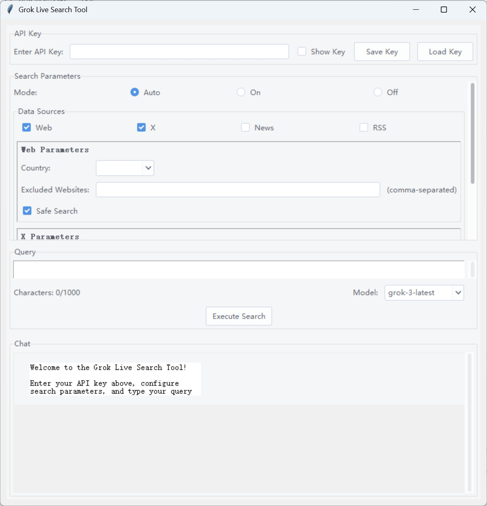

# Grok Live Search GUI Tool

A modern Python GUI application for interacting with Xai's Grok Live Search API. This tool provides an intuitive interface for configuring search parameters, managing your API key, and viewing results in a chat-like format.

## Features
- **API Key Management**: Securely enter, save, and load your Xai API key.
- **Flexible Search Parameters**: Configure search mode, sources (Web, X, News, RSS), date range, max results, and more.
- **Source-Specific Options**: Fine-tune each data source with country, safe search, excluded sites, handles, or RSS links.
- **Modern Chat UI**: Results are displayed in a bubble chat format, with clickable citation links.
- **Configurable Models**: Choose from available Grok models (e.g., `grok-3-latest`, `grok-2`, `grok-1.5-mini`).
- **Threaded Search**: UI remains responsive during API calls.
- **Save/Load Configurations**: Easily save and load your API key and search settings.

## Screenshots


## Installation

1. **Clone or Download** this repository to your local machine.
2. **Install Python 3.8+** if not already installed.
3. **Install required Python packages:**

```bash
pip install requests tkcalendar ttkthemes
```

- `tkcalendar` is required for date selection widgets.
- `ttkthemes` is optional, for improved UI appearance. The app will fall back to the default theme if not installed.

> The app will attempt to auto-install `tkcalendar` if missing, but manual installation is recommended for best results.

## Usage

1. **Obtain an Xai API Key** from [x.ai](https://x.ai/) (required).
2. **Run the application:**

```bash
python grok_live_search_gui_fixed.py
```

3. **Enter your API key** in the top field. You can save/load it for future use.
4. **Configure your search parameters** (mode, sources, date range, etc.).
5. **Type your query** and select the desired model.
6. **Click "Execute Search"** to send your query. Results will appear in the chat area, with citations if available.

## File Overview
- `grok_live_search_gui_fixed.py`: Main GUI application.
- `grok_live_search_api.py`: Handles API requests and response parsing.
- `grok_live_search_gui_design.md`: UI and feature design notes.

## Configuration
- **API Key**: Can be saved/loaded from `.ini` files using the GUI.
- **Search Parameters**: All options are available in the GUI, including advanced source-specific settings.

## Dependencies
- Python 3.8+
- [requests](https://pypi.org/project/requests/)
- [tkcalendar](https://pypi.org/project/tkcalendar/)
- [ttkthemes](https://pypi.org/project/ttkthemes/) (optional, for better UI)

## Troubleshooting
- If you see errors about missing `tkcalendar`, install it manually:
  ```bash
  pip install tkcalendar
  ```
- If you have issues with the UI theme, try installing `ttkthemes`:
  ```bash
  pip install ttkthemes
  ```
- Make sure your API key is valid and has access to the Grok Live Search API.
- For network/API errors, check your internet connection and API key permissions.

## License
*(Add your license here if applicable)*

## Acknowledgments
- Built with [Tkinter](https://docs.python.org/3/library/tkinter.html), [tkcalendar](https://github.com/j4321/tkcalendar), and [ttkthemes](https://github.com/RedFantom/ttkthemes).
- Powered by [Xai Grok Live Search API](https://x.ai/). 
